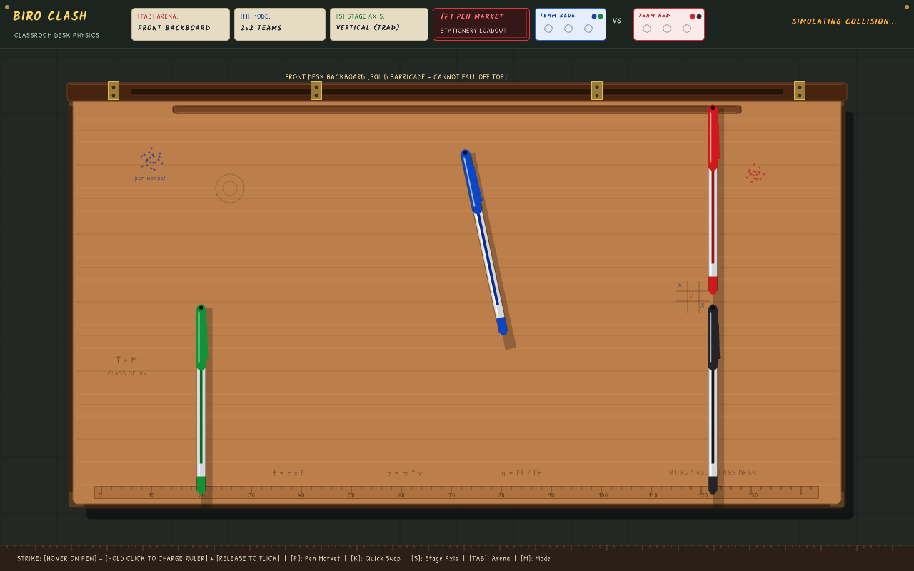
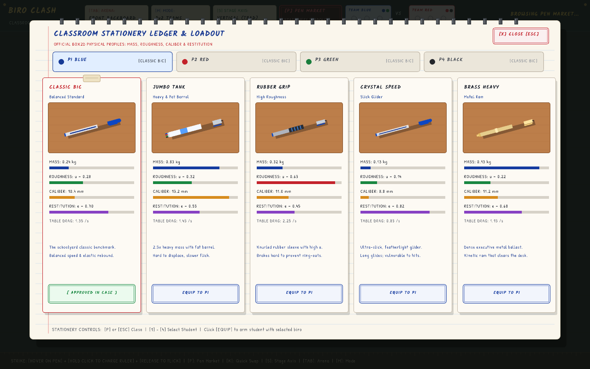

# 🖋️ BIRO CLASH: School Desk Physics

> **The Authentic Classroom Pen Flicking Physics Game.**  
> Built with **Box2D v3.2.0** and **Raylib 6.0** in pure C, compiling to both **Native Desktop** and **WebAssembly (HTML5)**.



---

## 🌍 100% Free Forever Hosting & Multiplayer ($0.00)

**Zero hosting fees. Zero game servers. Zero surprise bills if a tweet goes viral.**

| Layer | Implementation | Cost |
| :--- | :--- | :--- |
| **Game Client** | Client-side WebAssembly (`.wasm` + `.js`) compiled with Emscripten | **$0.00** (Free static hosting on GitHub Pages) |
| **Multiplayer Data** | Browser-to-Browser **WebRTC DataChannels** via PeerJS | **$0.00** (0 bytes transmitted through any server) |
| **NAT Traversal** | Free public Google STUN (`stun.l.google.com:19302`) | **$0.00** (Public utility) |
| **Signaling Broker** | Free public PeerJS cloud broker (`0.peerjs.com`) | **$0.00** (Zero infrastructure required) |
| **Single Player** | Built-in Autonomous Schoolyard AI Bot (offline capable) | **$0.00** (Runs entirely on client CPU) |

> [!TIP]
> Anyone who clicks a room link on **Twitter / X** or **WhatsApp** connects directly peer-to-peer into the match. If no peer is connected, the intelligent **Schoolyard AI Bot** automatically steps up so solo players can play instantly with zero wait times!

---

## 🎮 Match Types

1. **Solo vs AI Bot (`[O] MATCH: VS AI BOT`)**:
   Play against the autonomous Schoolyard AI bot. Features 4 difficulty tiers (`[I] AI DIFF`):
   - **Class Freshman** (Casual): Slower decisions, occasional loose flicks.
   - **Desk Mate** (Medium): Balanced strike line, solid table awareness.
   - **Class Prefect** (Hard): Sharp, direct edge-hunter targeting.
   - **Physics Prodigy** (Expert): Mathematical optimal torque $\vec{\tau} = \vec{r} \times \vec{F}$ sniper.
2. **Local Pass & Play (`[O] MATCH: LOCAL 2P`)**:
   2 to 4 players pass the mouse/keyboard on the same screen.
3. **Online P2P Duel (`[O] MATCH: ONLINE P2P`)**:
   Share your 1-click room URL or click **[ POST ON X / TWITTER ]** to challenge anyone online. Both browsers connect directly via WebRTC DataChannels.

---

## 🖊️ The Stationery Market & Loadout Garage (`[P] MARKET`)

Equip different biro models to fit your playstyle. Each pen model has authentic physical properties simulated directly in the Box2D v3 physics engine:



| Pen Model | Mass | Roughness ($\mu$) | Caliber | Restitution ($e$) | Table Drag | Tactical Profile |
| :--- | :--- | :--- | :--- | :--- | :--- | :--- |
| **Classic BIC** | 0.24 kg | 0.28 | 10.4 mm | 0.70 | 1.35 /s | The schoolyard benchmark: balanced speed & elastic rebound. |
| **Jumbo Tank** | 0.83 kg | 0.32 | 15.2 mm | 0.55 | 1.45 /s | 2.5x heavy mass with fat barrel: hard to displace, slower flick. |
| **Rubber Grip** | 0.32 kg | 0.65 | 11.0 mm | 0.45 | 2.25 /s | Knurled rubber sleeve with high $\mu$: brakes hard to prevent ring-outs. |
| **Crystal Speed** | 0.13 kg | 0.14 | 8.8 mm | 0.82 | 0.85 /s | Ultra-slick, featherlight glider: long glides, vulnerable to hits. |
| **Brass Heavy** | 0.93 kg | 0.22 | 11.2 mm | 0.68 | 1.15 /s | Dense executive metal ballast: kinetic ram that clears the desk. |

---

## 🏫 Desk Arenas & Starting Formations

### 1. Desk Arenas (`[TAB] ARENA`)
- **Open Desk**: Classic school desk where all 4 edges drop off into the classroom void.
- **Front Backboard**: Realistic classroom desk backboard where the top edge is a solid wooden barrier. Pens ricochet off the backboard!
- **Dual Aisle Barrier**: Double barricade along the top and bottom edges (aisle duel). Ring-outs only possible on left and right!

### 2. Starting Formations (`[S] STAGE`)
- **Vertical (Traditional Schoolyard)**: Pens start upright along the Y-axis. The broadside barrel is fully exposed, creating high-risk 1-hit KO potential!
- **Horizontal (Head-to-Head)**: Pens face each other tip-to-tip. Highly defensive, tactical glancing blows.
- **Cross Formation**: Alternating perpendicular alignments.

### 3. Game Modes (`[M] MODE`)
- **1v1 Duel**: Classic head-to-head match (First to 3 rounds).
- **2v2 Teams**: Team Blue (P1+P3) vs Team Red (P2+P4) with realistic friendly fire!
- **Battle Royale**: 4-player Free-For-All — last pen standing on the desk wins!

---

## 🕹️ Controls

| Control | Action | Description |
| :--- | :--- | :--- |
| **Mouse Hover** | Target Strike Point | Slide mouse along the biro barrel (nib, center, or rear plug) to place the rotating aim reticle. |
| **Hold Left Mouse Button** | Lock Angle & Charge | Freezes the 360° rotating arrow and begins charging impulse along the 15 cm wooden ruler bar. |
| **Release Left Mouse Button** | Strike / Flick | Delivers the Box2D impulse at the selected contact point with real torque! |
| **Right Mouse Button** | Abort Flick | Cancels current aim and ruler charging. |
| `[TAB]` | Cycle Arena | Switch between Open Desk, Front Backboard, and Dual Barrier. |
| `[M]` | Cycle Mode | Switch between 1v1 Duel, 2v2 Teams, and Battle Royale. |
| `[S]` | Cycle Stage | Switch between Vertical (Traditional), Horizontal, and Cross. |
| `[O]` | Match / Online | Open Online P2P invite modal or toggle match type. |
| `[I]` | AI Difficulty | Cycle AI difficulty (Freshman $\rightarrow$ Desk Mate $\rightarrow$ Prefect $\rightarrow$ Prodigy). |
| `[P]` | Pen Market | Open the Exercise Notebook Stationery Ledger to customize pen models. |
| `[R]` | Reset Match | Restart current round and scores. |
| `[T]` | Telemetry | Toggle real-time Box2D v3 physics telemetry readout. |
| `[F12]` | Screenshot | Export high-resolution screenshot. |

---

## 🚀 Deployment to GitHub Pages (2 Clicks, $0.00 Forever)

The included GitHub Actions workflow automatically compiles Box2D v3, links Raylib WebAssembly, and deploys the game directly to your free GitHub Pages site:

```
https://<your-username>.github.io/<your-repo>/
```

### Steps to Deploy:
1. Initialize git and push to GitHub:
   ```bash
   git init
   git add .
   git commit -m "feat: Biro Clash WebAssembly + Box2D v3"
   git remote add origin https://github.com/<your-username>/<your-repo>.git
   git push -u origin main
   ```
2. In your GitHub repository:
   - Go to **Settings** $\rightarrow$ **Pages**.
   - Under **Build and deployment** $\rightarrow$ **Source**, select **GitHub Actions**.
3. That's it! The workflow `.github/workflows/deploy.yml` triggers automatically, builds the WebAssembly binary with Emscripten, and publishes your game live.

---

## 🛠️ Local Development & Native Build

### Run Native Desktop Game (Windows)
```powershell
python build.py --run
```
*(Compiles all 40 Box2D v3 source files and Raylib natively with `zig cc` in ~2 seconds!)*

### Build WebAssembly Locally (Requires Emscripten `emsdk`)
```bash
python build_web.py
python -m http.server --directory web_dist 8000
```
Open `http://localhost:8000` in any web browser.

---

## 📐 Physics Architecture (Box2D v3.2.0)

- **Sub-Stepping**: 8 sub-steps per frame (480 Hz integration) to eliminate high-speed tunneling.
- **Continuous Collision Detection (CCD)**: Fast capsule sweeping prevents interpenetration during heavy power strikes.
- **Torque & Angular Impulse**:
  $$\vec{\tau} = \vec{r} \times \vec{F}$$
  Strikes off-center impart both linear velocity $\vec{v}$ and angular velocity $\vec{\omega}$, producing authentic spinning biro trajectories.
- **Surface Friction**:
  $$F_f \le \mu F_N$$
  Simulates the friction of hexagonal plastic barrels and rubber grips across rough classroom wood desks.
